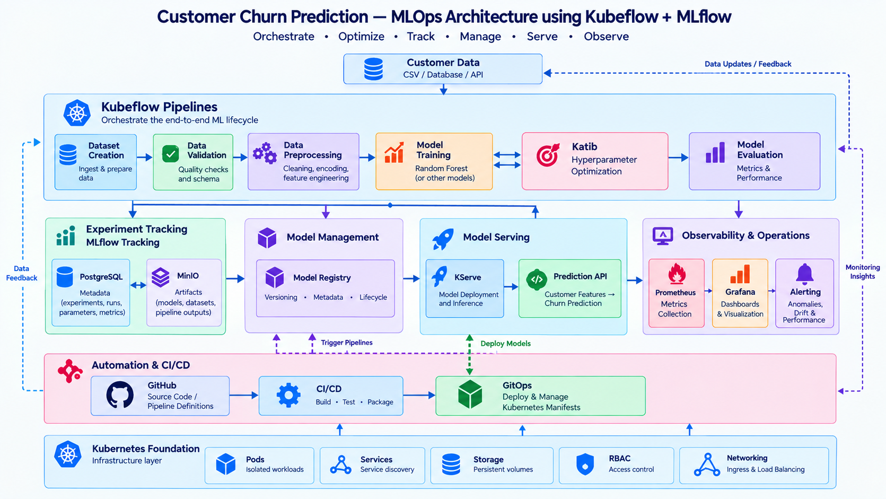

# Customer Churn Prediction — End-to-End MLOps on Kubernetes

An end-to-end, Kubernetes-native Machine Learning project built with **Kubeflow Community Distribution (KCD) 26.03.1**, **Kubeflow Pipelines 2.16.0**, and **MLflow 3.16.1**.

The project demonstrates the complete ML lifecycle: dataset generation and validation, preprocessing, model training, hyperparameter optimization, experiment tracking, artifact storage, model registration, model serving, prediction API development, monitoring, and GitOps-based deployment.

**Project repository:** https://github.com/zainul1114/customer-churn-kubeflow-mlflow

**Architecture:** [Customer Churn MLOps Architecture](images/ccp-mlops-arch-on-k8s.png)

---

## Project Objective

Build a reproducible, Kubernetes-native Customer Churn Prediction platform that demonstrates how data science workflows and cloud-native infrastructure work together.

The project combines Kubeflow Pipelines for orchestration, Katib for hyperparameter optimization, MLflow for experiment tracking, PostgreSQL for tracking metadata, MinIO for MLflow artifacts, Kubeflow Model Registry for model registration, KServe for serving, FastAPI for predictions, Prometheus and Grafana for monitoring, and GitHub Actions, GHCR, Kustomize, and Argo CD for CI/CD and GitOps.

The implementation has progressed beyond the original pipeline-and-tracking foundation. **Phases 1–6, 6.1, and 8–12 are completed and validated. Distributed training (Phase 7) remains planned.**

## What Is Customer Churn Prediction?

Customer churn prediction estimates whether a customer is likely to stop using a service. A machine-learning model learns patterns from customer attributes and historical churn labels, then predicts a churn class for a new customer record.

This project uses a synthetic dataset with fields including `age`, `tenure`, `monthly_charges`, `total_charges`, `contract_type`, `support_calls`, and `churn`.

After one-hot encoding `contract_type`, the Random Forest model expects eight features and returns:
- `0` — No Churn
- `1` — Churn

Example request:

```json
{
  "age": 35,
  "tenure": 12,
  "monthly_charges": 75.0,
  "total_charges": 900.0,
  "support_calls": 3,
  "contract_type": "Month-to-month"
}
```

The API transforms this record into the feature order expected by the model, sends it to KServe, and returns the prediction. This is a demonstration using synthetic data, not a validated business decision system.

## Complete Architecture



```text
Customer Churn Dataset
        |
        v
Kubeflow Pipelines
  |-- Dataset Creation
  |-- Data Validation
  |-- Preprocessing
  |-- Model Training
  |-- Model Evaluation
        |
        +---- Katib Hyperparameter Optimization
        |
        v
MLflow Tracking
   |                 |
   v                 v
PostgreSQL          MinIO
Metadata            ML Artifacts / Models
   |
   v
Kubeflow Model Registry
   |
   v
KServe Model Serving
   |
   v
FastAPI Prediction API
   |
   +---- Prometheus ---- Grafana


Developer --> GitHub --> GitHub Actions
                           |-- pytest
                           |-- Docker build
                           |-- Push image to GHCR
                                    |
                                    v
                              GitOps Repository
                                    |
                                    v
                                 Argo CD
                                    |
                                    v
                               Kubernetes
```

**Storage distinction:** KCD's Kubeflow Pipelines artifact storage in this environment uses the KCD-provided SeaweedFS integration. The separately deployed MinIO instance stores MLflow artifacts and model files. These are distinct storage systems.


# Tools and Technologies

| Tool | Components | Version | Purpose |
|---|---|---|---|
| **Kubernetes** | Kubernetes Cluster | 1.34+ | Provides the container orchestration platform for running, scheduling, networking, scaling, and managing all MLOps workloads. |
| **Kubeflow** | Kubeflow Community Distribution (KCD) | 26.03.1 | Provides the Kubernetes-native ML platform and integrates workflow orchestration, hyperparameter optimization, model serving, and model lifecycle capabilities. |
|  | Kubeflow Pipelines (KFP) | 2.16.0 | Provides container-based orchestration for building, executing, and managing reproducible ML workflows on Kubernetes. |
|  | Katib | 0.19.0 | Automates hyperparameter optimization by running multiple training trials with different parameter combinations and selecting the configuration that optimizes the target metric. |
|  | Model Registry | 0.3.7 | Provides model registration, versioning, metadata, and lifecycle management for trained ML models before they are deployed for inference. |
|  | KServe | 0.18.0 | Provides Kubernetes-native model serving and inference endpoints for deploying the trained Customer Churn model. |
| **MLflow** | MLflow Tracking Server | 3.16.1 | Tracks ML experiments, runs, parameters, metrics, model information, and artifacts throughout the training and evaluation lifecycle. |
|  | MLflow Model Logging | 3.16.1 | Logs the trained Scikit-learn model and associated model metadata as part of the MLflow run. |
| **PostgreSQL** | MLflow Backend Store | 15 | Stores MLflow tracking metadata including experiments, runs, parameters, metrics, and model-related metadata. |
| **MinIO** | S3-compatible Object Storage | Latest | Stores MLflow artifacts and model files in S3-compatible object storage. |
| **Scikit-learn** | RandomForestClassifier | 1.5.2 | Provides the machine learning algorithm used to train the Customer Churn classification model. |
| **Python** | Python Runtime | 3.11 | Provides the programming runtime used for pipeline components, model training, API development, and supporting scripts. |
| **Model Serialization** | skops | 0.16.0 | Used to securely serialize and load the Scikit-learn model for MLflow model logging. |
|  | joblib | 1.4.2 | Used to create the KServe-compatible `model.joblib` artifact for the Scikit-learn serving runtime. |
| **Object Storage SDK** | boto3 / botocore | Project dependency | Provides S3-compatible programmatic access to MinIO for uploading and downloading ML artifacts and models. |
| **FastAPI** | FastAPI | 0.115.6 | Provides the application-facing prediction API, request validation, feature transformation, KServe integration, health checks, and model readiness checks. |
|  | Uvicorn | 0.34.0 | Provides the ASGI application server used to run the FastAPI Customer Churn Prediction API. |
| **Prometheus** | Prometheus Server | 3.15.0 | Collects time-series metrics from the Customer Churn API and Kubernetes workloads for monitoring and observability. |
|  | ServiceMonitor | Prometheus Operator | Defines how Prometheus discovers and scrapes the Customer Churn API `/metrics` endpoint. |
| **Grafana** | Grafana Dashboard | Project deployment | Provides dashboards for visualizing prediction counts, API request rates, prediction latency, errors, and KServe model readiness. |
| **GitHub** | Git Repository | GitHub | Stores the application source code, ML pipelines, Kubernetes manifests, GitOps configuration, documentation, and project history. |
| **GitHub Actions** | CI Workflow | GitHub Actions | Automates Python dependency installation, pytest execution, Docker image building, and publishing of the API image to GHCR. |
| **GitHub Container Registry (GHCR)** | Container Registry | GitHub service | Stores versioned Customer Churn API container images produced by the CI pipeline. |
| **Docker** | Docker Engine / Dockerfile | Project deployment | Packages the FastAPI application, ML components, and supporting applications into reproducible container images. |
| **Kustomize** | Base + Dev Overlay | Kustomize | Manages Kubernetes manifests using reusable base resources and environment-specific overlays, including container image versioning. |
| **Argo CD** | Argo CD Application | Project deployment | Implements GitOps continuous delivery by monitoring the Git repository and reconciling the desired Kubernetes state with the actual cluster state. |
| **GitOps** | GitOps Repository | Project architecture | Maintains the desired Kubernetes deployment configuration separately from application source code and provides an auditable deployment workflow. |

## Project Phases and Status

| Phase | Scope | Status |
|---|---|---|
| 1 | Dataset creation and validation | **Completed** |
| 2 | Preprocessing and model training | **Completed** |
| 3 | Model evaluation | **Completed** |
| 4 | MLflow experiment tracking | **Completed** |
| 5 | PostgreSQL metadata and MinIO artifacts | **Completed** |
| 6 | Katib hyperparameter optimization | **Completed** |
| 6.1 | Katib best parameters integrated into MLflow training pipeline | **Completed** |
| 7 | Distributed training | **Planned** |
| 8 | Kubeflow Model Registry | **Completed** |
| 9 | KServe model serving | **Completed** |
| 10 | FastAPI prediction API | **Completed** |
| 11 | Prometheus and Grafana monitoring | **Completed** |
| 12 | GitHub Actions, GHCR, GitOps, and Argo CD | **Completed** |
| 13 | Production hardening and advanced MLOps | **Next** |

### Phases 1–5: Kubeflow Pipeline and MLflow

The baseline pipeline contains:

1. `create_dataset`
2. `validate_dataset`
3. `preprocess_data`
4. `train_model`
5. `evaluate_model`

KFP artifact inputs and outputs connect the tasks. The pipeline creates a synthetic customer dataset, validates it, preprocesses the categorical contract field, trains a Random Forest classifier, and evaluates it.

MLflow records parameters, metrics, model information, and evaluation artifacts. PostgreSQL stores MLflow tracking metadata, while MinIO stores MLflow artifacts.

### Phase 6: Katib Hyperparameter Optimization

Katib searched the following Random Forest parameters using Random Search, with eight trials and two parallel trials:

| Parameter | Search range |
|---|---|
| `n_estimators` | 50–200 |
| `max_depth` | 5–20 |
| `min_samples_split` | 2–10 |

Recorded best trial:

| Item | Result |
|---|---|
| Best trial | `customer-churn-randomforest-n4zqb8cq` |
| Katib objective accuracy | `0.635` |
| `n_estimators` | `117` |
| `max_depth` | `7` |
| `min_samples_split` | `9` |

### Phase 6.1: Katib-to-MLflow Integration

The optimized parameters were passed into a Kubeflow pipeline component. The component trained the model, logged the run and metrics to MLflow, and uploaded the model artifact to MinIO.

- KFP run ID: `bbc8aac4-7c9f-4ed4-ba7c-f4aa6ca41a00`
- MLflow run ID: `de79dc64abe8450790bff92694df78d3`
- MLflow run name: `katib-optimized-randomforest`

Recorded metrics:

| Metric | Value |
|---|---:|
| Training accuracy | 0.8300 |
| Test accuracy | 0.6250 |
| Test precision | 0.6125 |
| Test recall | 0.5269 |
| Test F1 | 0.5665 |

Katib's objective accuracy and the later pipeline test accuracy come from their respective executions and are not assumed to be identical.

### Phase 8: Kubeflow Model Registry

The trained model was registered in Kubeflow Model Registry.

| Field | Value |
|---|---|
| Model name | `customer-churn-randomforest` |
| Version | `v1.0.0` |
| Framework | Scikit-learn |
| Model type | `RandomForestClassifier` |
| Optimization | Katib Random Search |
| MLflow run | `de79dc64abe8450790bff92694df78d3` |

### Phase 9: KServe Model Serving

The model was deployed as a KServe `InferenceService` in the `kubeflow-user-example-com` namespace.

The MLflow 3 logged model artifact was stored as `model.skops`. The deployed KServe sklearn runtime expected a joblib/pickle-compatible model file, so a conversion job generated `model.joblib` and uploaded it to MinIO. KServe loaded the converted model and returned a ready status. A test prediction returned:

```json
{
  "predictions": [0]
}
```

### Phase 10: FastAPI Prediction API

FastAPI provides a JSON interface to the KServe model.

| Endpoint | Method | Purpose |
|---|---|---|
| `/health` | GET | API health |
| `/model/ready` | GET | Checks KServe model readiness |
| `/predict` | POST | Validates input and returns a prediction |
| `/metrics` | GET | Exposes Prometheus metrics |

Example response:

```json
{
  "prediction": 0,
  "churn": false,
  "prediction_label": "No Churn",
  "model": "customer-churn-randomforest",
  "features": [35, 12, 75.0, 900.0, 3, 1, 0, 0]
}
```

### Phase 11: Monitoring and Observability

Prometheus scrapes the FastAPI `/metrics` endpoint through a Kubernetes `ServiceMonitor`. Grafana dashboards display API and prediction metrics.

Custom metrics:

- `customer_churn_api_requests_total`
- `customer_churn_predictions_total`
- `customer_churn_api_errors_total`
- `customer_churn_prediction_latency_seconds`
- `customer_churn_kserve_ready`

Example PromQL:

```promql
sum(customer_churn_predictions_total)
```

```promql
sum by (label) (customer_churn_predictions_total)
```

```promql
sum(rate(customer_churn_api_requests_total[5m]))
```

```promql
histogram_quantile(
  0.95,
  sum by (le) (
    rate(customer_churn_prediction_latency_seconds_bucket[5m])
  )
)
```

### Phase 12: CI/CD and GitOps

GitHub Actions runs API tests and builds the Docker image. On push events, the workflow logs in to GHCR and publishes commit-based and default-branch image tags.

```text
GitHub source repository
        |
        v
GitHub Actions
  |-- pytest
  |-- Docker build
  |-- Push image to GHCR
        |
        v
GitOps manifests updated with image tag
        |
        v
Git commit and push
        |
        v
Argo CD detects repository state
        |
        v
Kustomize renders manifests
        |
        v
Kubernetes Deployment updated
```

The image validated during this phase was:

```text
ghcr.io/zainul1114/customer-churn-kubeflow-mlflow/customer-churn-api:d2f416d
```

The Argo CD application `customer-churn-dev` was verified as **Synced** and **Healthy**, and the Kubernetes Deployment rollout completed successfully.

## Repository Structure

This tree reflects the integrated project structure. Supporting scripts, manifests, and documentation are grouped by project component.

```text
customer-churn-kubeflow-mlflow/
├── .github/
│   └── workflows/
│       └── ci.yaml
├── README.md
├── LINKEDIN_POST.md
├── images/
│   ├── ccp-mlops-arch.png
│   ├── kubeflow_pipeline.png
│   └── mlflow_runs.png
├── pipelines/
│   └── customer_churn_mlflow_pipeline.py
├── customer_churn_katib_mlflow_phase6_1/
│   ├── README.md
│   ├── pipelines/
│   │   └── customer_churn_katib_optimized_mlflow_pipeline.py
│   ├── scripts/
│   │   └── get_katib_best_params.sh
│   ├── docs/
│   │   └── workflow.md
│   └── customer_churn_katib_optimized_mlflow_pipeline.yaml
├── katib/
│   ├── Dockerfile
│   ├── train.py
│   └── customer_churn_katib.yaml
├── mlflow/
│   ├── Dockerfile
│   └── mlflow-registry.yaml
├── model_registry/
│   └── scripts/
│       └── register_customer_churn_model.py
├── kserve/
│   ├── customer-churn-inferenceservice.yaml
│   ├── customer-churn-kserve-allow.yaml
│   ├── customer-churn-kserve-profile.yaml
│   └── customer-churn-sa.yaml
├── kserve_model_conversion/
│   ├── Dockerfile
│   ├── convert_model.py
│   └── kserve-model-conversion-job.yaml
├── customer_churn_project/
│   ├── api/
│   │   ├── Dockerfile
│   │   ├── main.py
│   │   ├── requirements.txt
│   │   └── customer-churn-api-servicemonitor.yaml
│   └── customer-churn-api.yaml
├── tests/
│   ├── mlflow_artifact_test.py
│   └── test_customer_churn_api.py
├── gitops/
│   └── customer-churn-api/
│       ├── base/
│       │   ├── deployment.yaml
│       │   ├── service.yaml
│       │   ├── servicemonitor.yaml
│       │   └── kustomization.yaml
│       └── overlays/
│           └── dev/
│               └── kustomization.yaml
├── argocd/
│   └── customer-churn-argocd.yaml
└── docs/
    ├── customer-churn-prediction.md
    └── workflow.md
```

## Run and Validate

### Compile the baseline pipeline

```bash
python pipelines/customer_churn_mlflow_pipeline.py
```

The compiler generates the pipeline YAML. Upload it to Kubeflow Pipelines and create a run.

### Run API tests

```bash
python3.11 -m pip install -r customer_churn_project/api/requirements.txt
python3.11 -m pytest -v tests/test_customer_churn_api.py
```

The API test suite previously completed with **8 passed**.

### Build the API container locally

```bash
docker build \
  -t customer-churn-api:local \
  customer_churn_project/api
```

### Render GitOps manifests

```bash
kustomize build gitops/customer-churn-api/overlays/dev
```

### Check Argo CD

```bash
kubectl get applications -n argocd
kubectl get application customer-churn-dev -n argocd \
  -o jsonpath='{.status.sync.status}{"\n"}{.status.health.status}{"\n"}'
```

### Check the API deployment

```bash
kubectl get deployment customer-churn-api -n kubeflow-user-example-com
kubectl get pods -n kubeflow-user-example-com -l app=customer-churn-api
kubectl rollout status deployment/customer-churn-api \
  -n kubeflow-user-example-com
```

## Important Project Notes

- KFP artifact storage and MLflow's MinIO artifact store are separate storage systems in this deployment.
- PostgreSQL stores MLflow tracking metadata; MinIO stores MLflow model and run artifacts.
- The original MLflow model artifact uses `model.skops`; the KServe sklearn runtime in this setup uses the converted `model.joblib`.
- The current FastAPI deployment uses a revision-specific KServe private service URL. Replacing it with a stable endpoint is an identified Phase 13 hardening task.
- The project uses synthetic data. Its metrics demonstrate the workflow and are not evidence of model performance on a real customer population.
- Development credentials should be replaced with securely managed credentials before production use.

## Next: Phase 13 — Production Hardening and Advanced MLOps

Planned tasks:

1. Replace the revision-specific KServe private service URL with a stable endpoint.
2. Improve API-to-KServe resilience, timeouts, and error handling.
3. Introduce GitOps-compatible secret management.
4. Scan container images and generate an SBOM.
5. Harden containers and Kubernetes workloads (non-root execution, resource controls, security context, and least privilege).
6. Improve CI/CD with security checks and controlled image promotion.
7. Add model/data monitoring and alerting where suitable evaluation data is available.
8. Review Argo CD RBAC, sync policies, pruning, and self-healing.
9. Complete distributed training as a separate planned milestone if it remains in scope.

---

## Author

**Azilehub Academy**

Focused on practical learning and engineering across DevOps, MLOps, Kubernetes, AI infrastructure, HPC, and cloud-native platforms.

Repository: https://github.com/zainul1114/customer-churn-kubeflow-mlflow
